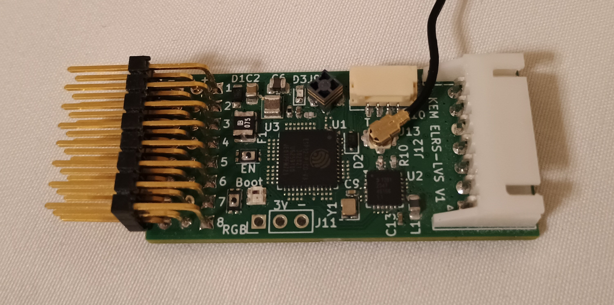

# km-elrs-lvs
A 2.4ghz ExpressLRS-compatible PWM receiver with integrated cell monitoring. KiCad project and related files.

This was created as a personal project to offset having used propreitary radio systems for several years prior (the previous truely usable open standard being PPM/FM): Suddenly (from my perspective) the community has an open source radio system and it also happens to be the best performing? I had to have one, so I made one.

Specs:
- ESP32 (PICO-V3) processor
- SX1280/1281 telemetry radio (direct 1x1, +12.5dBm) anything fancier isn't necessary for outdoor los on a small/medium plane (but more importantly would have been less likely to succeed when hand built)
- 1-3s (3.0-17v) input/servo power, with external brownout detector (the esp builtin one is problematic)
- 8 Channel PWM output, on standard servo pin headers
- JST GH CRSF/Serial/programming connector (similar to radiomaster cables)
- 7 channel voltage sense connector, measuring -5 to +35v (for 2-6s standard lipo balance plugs)

This not a beginner soldering project.  It is built similarly to most RC hardware - double sided with (almost) minimal compoent sizes crammed as close as possible to each other to save size and weight.  That said, it can be assembled by hand - I had no significant issues, although I recommend using at least a paste stencil.

The Wifi (ceramic tower) and ELRS (u.fl) footprints are made more interchangable for experimental purposes. As of version 1, the CRSF connector pinout is non-standard, due to an oversight (I thought it was downside up when I copied it from radiomaster's cable example). There are many test/cut points that could be removed to save space on a version 2 (none of the cut points were necessary, which is a great success, and why it's stuck at the first version)

Version 2 (Not yet tested) removes the test points, moves all components to the front side, fixes the CRSF pinout to match radiomaster cables, and uses larger clearances to allow a slightly cheaper pcb process.

Despite this project being built mostly a cathartic exercise, this has the unique (as of writing) feature of monitoring individual lithium cell voltages integrated into the receiver. This is the most common telemetry item I personally use on aircraft - Having it integrated, in addition to the weight/size reduction, is intended to increase the durability of combat aircraft (on which the cell sensor and interconnect is a common failure point), and otherwise reduce the chance for an aircraft to be missing its sensor. The cost is also theoretically lower than the equivalent two devices, since this only requires hardware integrated into the receiver cpu, but i'd have to sell them for that to actually make sense. This feature currently requires a small amount of custom software, see related repository (TODO LINK HERE).

Some footprints are Borrowed from other public hardware examples:
- https://github.com/crteensy/ELRS-8285-1280-5xPWM.git 
- https://github.com/AnyLeaf/elrs-hardware.git

To build firmware images for this and similar unsupported hardware, one can add an entry to ExpressLRS/targets/targets.json , after which platformio or elrs configurator in local mode can be used.
```
"km_lvs": {
                "product_name": "Kevin LVS 2.4GHz 8xPWM RX",
                "lua_name": "KM LVS",
                "layout_file": "elrs-lvs.json",
                "upload_methods": ["uart", "wifi"],
                "min_version": "3.3.0",
                "platform": "esp32",
                "firmware": "Unified_ESP32_2400_RX"
            },
```

